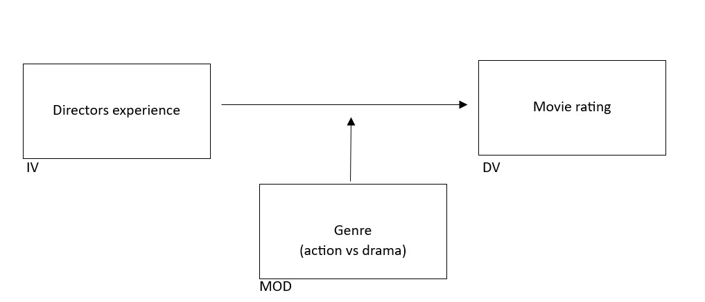

# Does directional experience influence IMDb ratings? 
## Examining how director experience predicts IMDb ratings and how this relationship differs between drama and action movies.

This study’s aim is to analyse whether a directors experience leads to higher IMDb ratings and whether this link depends on the type of movie (drama vs action). Directional experience will be measured as the cumulative number of minutes of movies directed in the past, rather than the number of movies. This choice reflects the fact that movies vary greatly in length. This measure accounts for both the quantity and scale of the director’s past work.  
Besides analysing the main effect of director’s experience on movie ratings, this study also investigates this relationship with the moderating effect of action- and drama movies. 

## Motivation

*Academically Relevant*

This study contributes to research on the movie industry by examining how directors’ cumulative experience predicts movie evaluations. The IMDb ratings capture consumer evaluation patterns. Prior research has shown that the director’s experience also influences the movie outcome. Directors with more experience are more likely to produce movies that achieve higher ratings (John et al., 2014). 
Furthermore, genre could play a crucial role, Francemone et al. (2023) examined 9,068 movies over twenty years and found out that action movies tend to be more popular with a higher audience causing higher box office numbers and more IMDb reviews than drama movies. However, drama movies are strongly linked with critical acclaim and get higher ratings (Francemone et al., 2023). This evidence shows the importance of considering genre when analysing how directional experience relates to movie ratings. 

*Managerially Relevant*

For studios and investors making decisions, insights into how directors´ experience influences audience evaluations are a clear practical value. If director experience correlates with IMDb ratings, this makes hiring decisions easier. Experience may become a signal of quality and predictability of outcomes. Moreover, it is essential to consider differences in genres. Dramas typically rely more on director-driven elements (Francemone et al., 2023). In this context, director experience is more likely to enhance quality and reduce both artistic and commercial risk. Action movies, by contrast, often depend more heavily of technical production capacities. Here, managers may mitigate risk more effectively by investing in technical teams, rather than relying solely on director experience. For decision-makers, this implies differentiated allocation of talent and budget.

**To what extent does a director’s prior experience (measured as the cumulative minutes of movies directed) predict a movie’s IMDb rating, and does this relationship differ between action and drama movies?**

##Conceptual model

## Data
We used the following datasets: 

*name.basics.tsv*

*title.basics.tsv*

*title.crew.tsv*

*title.ratings.tsv*

The data was obtained from the IMDb database. 

- How many observations are there in the final dataset? 
- Include a table of variable description/operstionalisation. 

## Method

Multiple linear regression analysis

To address our research question, multiple linear regression analysis is appropriate because it allows us to examine the relationship between a metric independent variable (directional experience) and a metric dependent variable (IMDb rating), while incorporating a non-metric moderator (movie genre: action vs. drama) through dummy coding. This approach enables estimation of both direct and interaction effects within a single model and allows inclusion of control variables, improving interpretability and reducing potential confounding.
Moreover, multiple regression provides a flexible framework to test whether the effect of director experience differs across genres. By measuring effect sizes and accounting for multiple predictors at the same time, the method offers meaningful insights into how experience and genre jointly influence movie ratings.
 

## Preview of Findings 
- Describe the gist of your findings (save the details for the final paper!)
- How are the findings/end product of the project deployed?
- Explain the relevance of these findings/product. 

## Repository Overview 

**Include a tree diagram that illustrates the repository structure*

## Dependencies 

*Explain any tools or packages that need to be installed to run this workflow.*

## Running Instructions 

*Provide step-by-step instructions that have to be followed to run this workflow.*

## Sources
- Francemone, C. J., Kryston, K., & Grizzard, M. (2023). Examining genre success, co-occurrence, release, and production of 9,068 films over twenty years. Poetics, 99, 101794. https://doi.org/10.1016/j.poetic.2023.101794
- John, K., Ravid, S. A., & Sunder, J. (2014). Managerial ability and success: Evidence from the career paths of film directors. Journal Of Corporate Finance. http://dx.doi.org/10.1016/j.jcorpfin.2014.11.001

## About 

This project is set up as part of the Master's course [Data Preparation & Workflow Management](https://dprep.hannesdatta.com/) at the [Department of Marketing](https://www.tilburguniversity.edu/about/schools/economics-and-management/organization/departments/marketing), [Tilburg University](https://www.tilburguniversity.edu/), the Netherlands.

The project is implemented by team 10

Members: 

Daan Bankers              snr:2100281

Luc Vesters				        snr:2145531

Seppe Bogers				      snr:2080522

Melvin Hong				        snr:2146253

Wouter van der Linden			snr:2116790

Marvin  Herwig			    	snr:2138521

